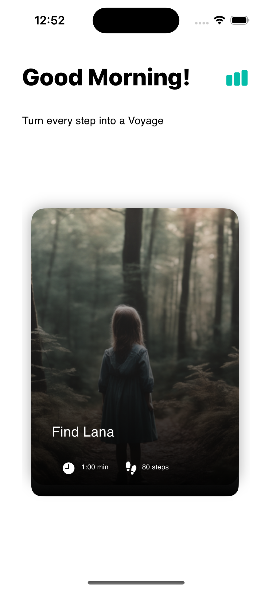
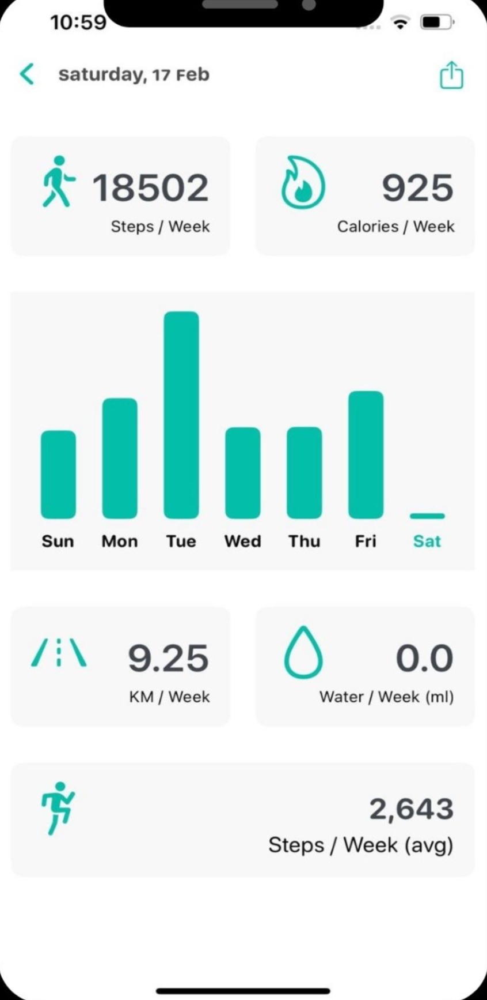

# Voyage | Walk

## 📱 Overview:

Voyage is a mobile application designed to make walking more engaging and enjoyable through immersive story based challenges.
The app motivates users to stay active by combining physical activity with interactive audio adventures, allowing users to progress through challenges and unlock story experiences as they walk.

## ✨ Features

### 🎧 Immersive Storytelling
Users can participate in walking challenges that are powered by diverse audio stories, creating a unique and engaging experience while exercising.

### 🔊 Spatial Audio Experience
The application utilizes Spatial Audio technology to provide a more immersive and realistic listening experience throughout the challenges.

### 🚶 Accurate Step Tracking
Tracks users’ walking activity and step count with precision to ensure accurate challenge progress and activity monitoring.

### 🔥 Activity Insights
Provides detailed statistics, including:
	•	Step Count
	•	Distance Traveled
	•	Calories Burned
	•	Walking Progress

### 🏆 Challenge-Based Motivation
Encourages users to stay active through goal-oriented challenges and achievement-based progression.

## 📷 Screenshots

  
  
  

## 🛠️ Technologies Used
	•	Swift
	•	SwiftUI
	•	Xcode
	•	Firebase
	•	Figma
	•	Core Motion
	•	Spatial Audio

## 🎯 Objective
The goal of WalkQuest is to transform walking from a routine activity into an engaging experience by combining fitness, storytelling, and immersive audio technology.

## 📲 App Store
Download the application from the App Store:
https://apps.apple.com/sa/app/voyage-walk/id6478062168?l=ar
